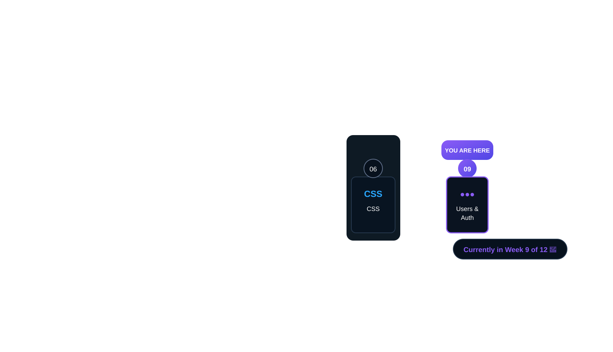

<div align="center">

# 💻 Web Application Development with Python

### <sub>Tuwaiq Academy • Programming Fundamentals Bootcamp</sub>

**A hands-on journey from programming fundamentals to real-world web applications.**

🐍 Python · 🌐 Web Development · 🗄️ Databases · 🔀 Git & GitHub · 🚀 Django



</div>

---

## 🚀 About the Bootcamp

This repository documents my learning journey through **Web Application Development with Python** at **Tuwaiq Academy**.

The bootcamp focuses on building a strong programming mindset, solving problems with code, and gradually turning fundamentals into practical web applications.

The journey combines daily practice, hands-on exercises, mini projects, larger projects, teamwork, version control, and a final **Capstone Project**.

---

## 🎯 What I'm Learning

| Area | Focus |
|---|---|
| 🧠 Programming | Logic, problem solving, algorithms, and programming fundamentals |
| 🐍 Python | Core syntax, data, control flow, functions, and practical programming |
| 🖥️ CLI | Command-line basics and working with the development environment |
| 🔀 Git & GitHub | Version control, collaboration, branches, commits, and project history |
| 🌐 Web | Internet and web fundamentals |
| 🧱 HTML | Building the structure of web pages |
| 🎨 CSS | Styling, layouts, responsive interfaces, and visual design |
| 🟢 Django | Building web applications with Python |
| 🗄️ Databases & ORM | Managing data and connecting applications to databases |
| 👤 Users & Authentication | Users, permissions, validation, and secure application flows |
| 🚀 APIs & Deployment | Building, testing, and preparing applications for real-world use |
| 🏆 Capstone | Bringing the skills together in a final project |

---

## 🧩 Skills I'm Building

- 💡 Problem solving & logical thinking
- 🐍 Python programming
- 🌐 Web application development
- 🗄️ Database handling
- 🔐 Validation & authentication concepts
- 🐞 Debugging and improving code
- 🔀 Version control with Git
- 🤝 Team collaboration with GitHub
- 🛠️ Project planning and implementation
- 🚀 Turning ideas into working applications

---

## 🛠️ Technology Stack

<div align="center">

`🐍 Python` &nbsp; `🌐 HTML5` &nbsp; `🎨 CSS3` &nbsp; `🟢 Django` &nbsp; `🗄️ SQL / Databases` &nbsp; `🔀 Git` &nbsp; `🐙 GitHub` &nbsp; `⌨️ CLI`

</div>

---

## 🗺️ Learning Path — 12 Weeks

```text
01  CLI & Basics
 ↓
02  Git & GitHub
 ↓
03  Python Fundamentals
 ↓
04  Web & Internet
 ↓
05  HTML
 ↓
06  CSS                      ✅
 ↓
07  Django Basics              ✅
 ↓
08  Databases & ORM            ✅
 ↓
09  Current Stage — Day 1        🟣
 ↓
10  Advanced Django             ⏳
 ↓
11  APIs & Deployment           ⏳
 ↓
12  Capstone Project            🏆
```

### 📍 Current Progress

**Week 9 / 12 — Day 1**

`███████████████░░░░░` **In Progress**

> One step at a time. Every project adds another piece to the bigger picture. ✨

---

## 🏗️ Learning Approach

The bootcamp is built around **learning by doing**:

- ⚡ Daily practical tasks
- 🧪 Hands-on exercises
- 🧩 Mini projects
- 🏗️ Larger practical projects
- 🤝 Team collaboration
- 🔁 Build → Test → Improve
- 🏆 Capstone project

---

## 📂 Repository Structure

```text
python-bootcamp/
│
├── Week 1/
├── Week 2/
├── Week 3/
├── Week 4/
├── Week 5/
├── Week 6/
├── Week 7/
├── Week 8/
├── Week 9/
│
├── assets/
│   └── bootcamp-overview.png
│
└── README.md
```

Each week contains the work, exercises, projects, and a dedicated visual summary of that stage of the journey.

---

## 📚 Weekly Journey

| Week | Status |
|---|---|
| Week 01 | ✅ Completed |
| Week 02 | ✅ Completed |
| Week 03 | ✅ Completed |
| Week 04 | ✅ Completed |
| Week 05 | ✅ Completed |
| Week 06 | ✅ Completed |
| Week 07 | ✅ Completed |
| Week 08 | ✅ Completed |
| Week 09 | 🟣 In Progress |
| Week 10 | ⏳ Upcoming |
| Week 11 | ⏳ Upcoming |
| Week 12 | 🏆 Capstone |

---

## 👩‍💻 Trainee

**Sarah Alsubaie**  
🔗 [LinkedIn](https://www.linkedin.com/in/sarah-alsubaie-a41199217/) · [GitHub](https://github.com/Sarahibr8)

---

<div align="center">

### ✨ Learn. Build. Solve. Grow.

*The goal isn't just to write code — it's to learn how to turn problems into solutions.*

**🚀 Keep Learning · Keep Building · Never Stop**

</div>
