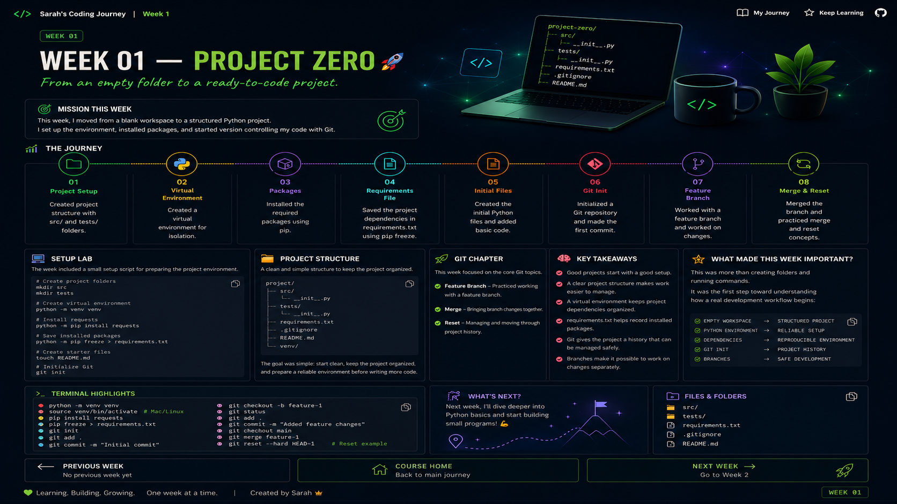

# 🚀 WEEK 01 — PROJECT ZERO

> **From an empty folder to a ready-to-code project.**

---

## 🎯 Mission of the Week

This week was the starting point of the journey: setting up a Python project, creating an organized workspace, preparing a virtual environment, installing a package, and beginning to manage the project with Git.

---

## 🧭 The Journey

| Stage | Focus | What I Worked On |
|:---:|---|---|
| `01` | 📁 Project Setup | Created `src` and `tests` folders |
| `02` | 🐍 Virtual Environment | Created a Python virtual environment |
| `03` | 📦 Packages | Installed the `requests` package |
| `04` | 📄 Requirements | Saved installed packages in `requirements.txt` |
| `05` | 🧩 Starter Files | Created the initial project files |
| `06` | 🔧 Git | Initialized a Git repository |
| `07` | 🌿 Branches | Worked with a feature branch |
| `08` | 🔀 Merge & Reset | Practiced merge and reset concepts |

---

<p align="center">
  
</p>

---

## 💻 Setup Lab

The week included a small setup script for preparing the project environment.

```powershell
# Create project folders
mkdir src
mkdir tests

# Create virtual environment
python -m venv venv

# Install requests
python -m pip install requests

# Save installed packages
python -m pip freeze > requirements.txt

# Create starter files
ni src\main.py
ni README.md

# Initialize Git
git init
```

---

## 📁 Project Structure

```text
project/
│
├── src/
│   └── main.py
│
├── tests/
│
├── requirements.txt
├── README.md
└── venv/
```

> The goal was simple: start clean, keep the project organized, and prepare a reliable environment before writing more code.

---

## 🌿 Git Chapter

One of the main topics in this week was **Git Branches, Merge and Reset**.

### Feature Branch

I practiced working with a **feature branch** and added feature changes without keeping everything on the main line of work.

### Merge

The week also introduced the idea of bringing branch changes together through a **merge**.

### Reset

I also explored **Git reset** as a way to manage and move through project history.

---

## 🧠 Key Takeaways

> **Good projects start with a good setup.**

- A clear project structure makes work easier to manage.
- A virtual environment keeps project dependencies organized.
- `requirements.txt` helps record installed packages.
- Git gives the project a history that can be managed safely.
- Branches make it possible to work on changes separately.

---

## ✨ What Made This Week Important?

This was more than creating folders and running commands.

It was the first step toward understanding how a real development workflow begins:

```text
EMPTY WORKSPACE
      ↓
PROJECT STRUCTURE
      ↓
PYTHON ENVIRONMENT
      ↓
DEPENDENCIES
      ↓
GIT
      ↓
BRANCHES
      ↓
PROJECT HISTORY
```

---

## 🏁 Week 01 Complete

**Status:** `✅ Completed`

> One week. One setup. One step closer to becoming a better developer. 🚀

---

## 🧭 Keep Exploring

<p align="center">
  <a href="../README.md">🏠 <strong>Course Home</strong></a>
  &nbsp;&nbsp;&nbsp;|&nbsp;&nbsp;&nbsp;
  <a href="../Week%202/README.md"><strong>Next Week →</strong> 🚀</a>
</p>

---

<p align="center">
  <sub>Sarah's Coding Journey • Week 01</sub>
</p>
