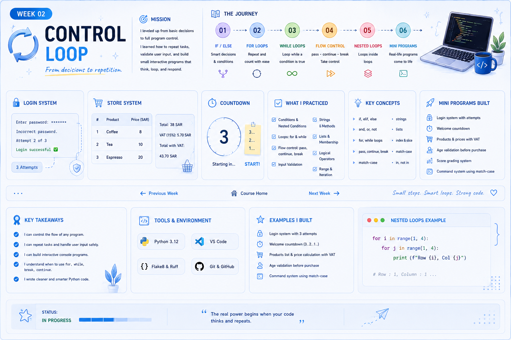

# 🔁 WEEK 02 — CONTROL LOOP

> **From decisions to repetition.**

## 🎯 Mission of the Week

This week, I moved from making simple decisions to controlling how a program behaves.

I practiced conditions, loops, input validation, flow control, and small interactive Python programs.

---

## 🧭 The Journey

| Stage | Focus | What I Practiced |
|---|---|---|
| 01 | IF / ELSE | Conditions and decisions |
| 02 | FOR LOOPS | Repetition with `range()` |
| 03 | WHILE LOOPS | Repetition while a condition is true |
| 04 | FLOW CONTROL | `pass` • `continue` • `break` |
| 05 | NESTED LOOPS | Loops inside loops |
| 06 | MINI PROGRAMS | Combining logic into programs |

---

  

---

## 🧠 Key Concepts

- `if / elif / else` and nested conditions
- `and / or / not` and truthy / falsy
- `match / case`
- `for` and `while` loops
- `break`, `continue`, and `pass`
- Input validation with `isdigit()`
- Strings: indexing, slicing, `find()`, `replace()`, `split()`, `join()`, `strip()`, `lower()`, `upper()`, `title()`
- Lists and membership with `in`
- `type()`, `isinstance()`, `==`, `is`, and `id()`

## 🧪 What I Practiced

- 🔐 Login system with limited attempts
- ⏱️ Countdown programs
- 🛒 Products, prices, and VAT
- 🎂 Age validation
- 📊 Score grading
- 💻 Command systems with `match / case`
- 🔢 Even / odd counting and totals
- 🔁 Input validation and repetition

## 🛠️ Tools

- Python
- VS Code
- Flake8
- Ruff
- Git / GitHub

## 💡 Key Takeaways

> **The real power begins when your code thinks and repeats.**

- Control the flow of a program.
- Repeat tasks using `for` and `while`.
- Validate input before using it.
- Use `break`, `continue`, and `pass` when needed.
- Combine conditions and loops to build interactive console programs.

---

## 🏁 Week 02 Complete

**Status:** ✅ Completed

---

## 🔗 Keep Exploring

**⬅️ [Previous Week — Week 1](../Week%201/README.md)**  
&nbsp;&nbsp;|&nbsp;&nbsp;
**🏠 [Course Home](../README.md)**  
&nbsp;&nbsp;|&nbsp;&nbsp;
**[Next Week — Week 3 ➡️](../Week%203/README.md)**

---

  Sarah's Coding Journey • Week 02

