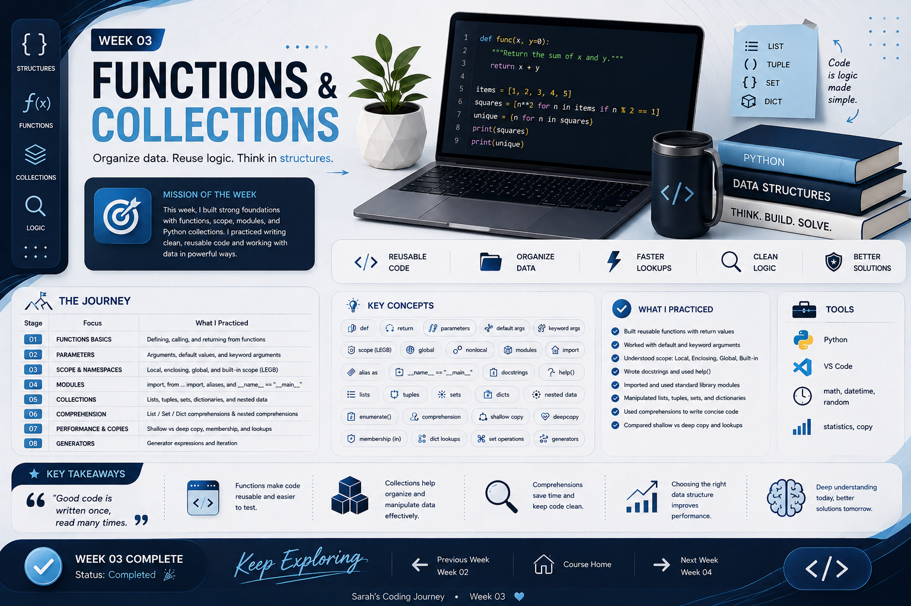

# 🪄 WEEK 03 — FUNCTIONS & COLLECTIONS

> **Organize data. Reuse logic. Think in structures.**

## 🎯 Mission of the Week

This week, I built stronger Python foundations by working with reusable functions, scope, modules, collections, comprehensions, generators, and data-copying concepts.

---

## 🧭 The Journey

| Stage | Focus | What I Practiced |
|---|---|---|
| 01 | FUNCTIONS | Defining, calling, parameters, and `return` |
| 02 | SCOPE | Local, Enclosing, Global, and Built-in scope |
| 03 | MODULES | `import`, aliases, and `__main__` |
| 04 | COLLECTIONS | Lists, tuples, sets, dictionaries, nested data |
| 05 | COMPREHENSIONS | List, set, and dictionary comprehensions |
| 06 | COPIES & LOOKUPS | Shallow/deep copy, membership, dictionary lookups |
| 07 | GENERATORS | Generator expressions and iteration |

---

  

---

## 🧠 Key Concepts

- Functions, parameters, default arguments, keyword arguments, and `return`
- `None`, docstrings, and `help()`
- Scope: Local, Enclosing, Global, Built-in
- `globals()`, `locals()`, and `nonlocal`
- Modules, imports, aliases, and `if __name__ == "__main__"`
- Lists, tuples, sets, dictionaries, and nested data
- `enumerate()` and dictionary lookups
- List / set / dictionary comprehensions
- Shallow copy vs deep copy
- Membership and lookup concepts
- Generator expressions and `next()`

## 🧪 What I Practiced

- 🔧 Built reusable functions with different argument styles
- 📦 Created and imported modules
- 🌐 Worked with Python scope and namespaces
- 🗂️ Manipulated different collection types
- ⚡ Rewrote loops using comprehensions
- 🧬 Compared aliases, shallow copies, and deep copies
- 📊 Built student reports with averages and filtering
- 🔄 Used generators for lazy iteration

## 🛠️ Tools & Libraries

- Python
- VS Code
- `math`
- `datetime`
- `random`
- `statistics`
- `copy`

## 💡 Key Takeaways

> **Good code is written once, read many times.**

- Functions make code reusable and easier to test.
- Collections help organize and manipulate data effectively.
- Comprehensions can make repeated data transformations concise.
- The right data structure can improve how efficiently information is accessed.
- Deep copying is useful when independent nested data is required.
- Generators allow values to be produced as they are needed.

---

## 🏁 Week 03 Complete

**Status:** ✅ Completed

---

## 🔗 Keep Exploring

**⬅️ [Previous Week — Week 2](../Week%202/README.md)**  
&nbsp;&nbsp;|&nbsp;&nbsp;
**🏠 [Course Home](../README.md)**  
&nbsp;&nbsp;|&nbsp;&nbsp;
**[Next Week — Week 4 ➡️](../Week%204/README.md)**

---

  Sarah's Coding Journey • Week 03

