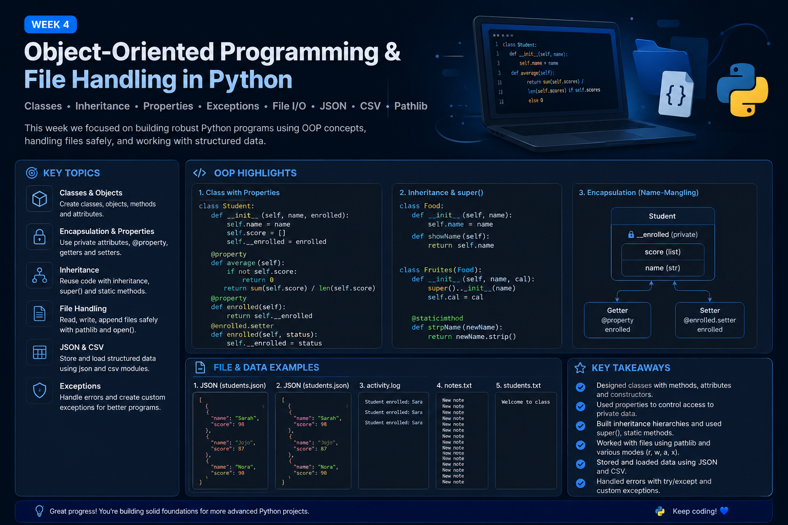

# 🧩 WEEK 04 — OBJECT-ORIENTED PROGRAMMING & FILE HANDLING

> **From reusable objects to reliable data.**

## 🎯 Mission of the Week

This week focused on building stronger Python programs with **classes and objects**, while learning how to work with files and structured data safely.

I practiced object-oriented programming, encapsulation, inheritance, properties, exceptions, file I/O, JSON, CSV, and `pathlib`.

---

## 🧭 The Journey

| Stage | Focus | What I Practiced |
|---|---|---|
| 01 | Classes & Objects | Classes, objects, attributes, constructors, and methods |
| 02 | Encapsulation | Private attributes, name-mangling, getters, and setters |
| 03 | Properties | `@property` and controlled attribute access |
| 04 | Inheritance | Parent/child classes, `super()`, and static methods |
| 05 | File Handling | Reading, writing, appending, and file paths |
| 06 | Structured Data | JSON and CSV files |
| 07 | Exceptions | `try/except`, validation, and custom exceptions |
| 08 | Practice | Combining OOP, files, and validation |

---

  

---

## 🧠 Key Concepts

- Classes and objects
- `__init__()` and instance attributes
- Instance methods
- `__str__()`
- Encapsulation and name-mangling
- `@property`, getters, and setters
- Inheritance and `super()`
- `@staticmethod`
- `pathlib.Path`
- File modes: `r`, `w`, `a`, `x`
- Reading and writing text files
- JSON and CSV
- `try / except / else / finally`
- `raise` and custom exceptions

## 🧪 What I Practiced

- 👩‍🎓 Student classes with scores and averages
- 🎫 Ticket and status objects
- 👋 Greeter and welcome classes
- 🐕 Encapsulation with private/class attributes
- 🍎 Inheritance with `Food` and `Fruites`
- 📁 Creating and inspecting directories and paths
- 📝 Reading, writing, and appending files
- 🗂️ Saving and loading student data with JSON
- ⚠️ Validating data and handling file errors
- 🛡️ Creating custom exceptions

## 📂 Data & File Practice

I worked with examples including:

- `students.json`
- `students.txt`
- `notes.txt`
- `activity.log`
- JSON student records
- File and directory paths using `pathlib`

## 💡 Key Takeaways

> **Good programs don't just work — they manage data and errors safely.**

- Classes help organize related data and behavior.
- Properties provide controlled access to attributes.
- Inheritance helps reuse existing code.
- `pathlib` makes file and path handling clearer.
- JSON and CSV make structured data easier to store and load.
- Exceptions help programs respond safely to unexpected situations.

---

## 🏁 Week 04 Complete

**Status:** ✅ Completed

---

## 🔗 Keep Exploring

**⬅️ [Previous Week — Week 3](../Week%203/README.md)**  
&nbsp;&nbsp;|&nbsp;&nbsp;
**🏠 [Course Home](../README.md)**  
&nbsp;&nbsp;|&nbsp;&nbsp;
**[Next Week — Week 5 ➡️](../Week%205/README.md)**

---

  Sarah's Coding Journey • Week 04

