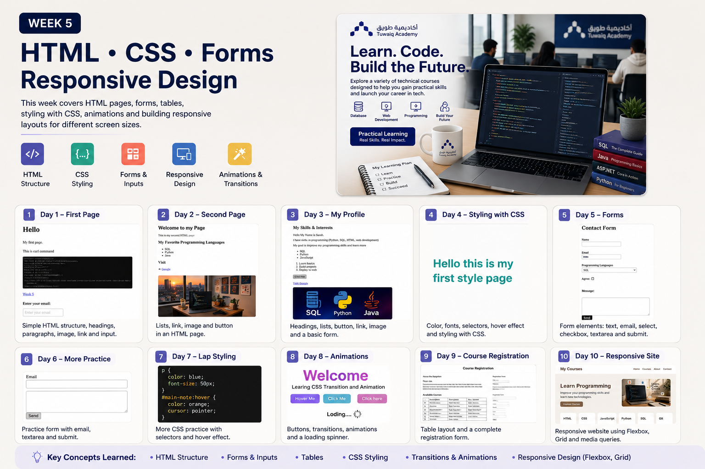

# 💻 WEEK 05 — HTML • CSS • FORMS • RESPONSIVE DESIGN

> **Learn. Code. Create.**

## 🎯 Mission of the Week

This week moved from basic HTML pages into styling, forms, CSS transitions and animations, and responsive web design.

I practiced building pages, adding links and images, creating forms and tables, styling elements with CSS, and making layouts adapt to different screen sizes.

## 🧭 The Journey

| Stage | Focus | What I Practiced |
|---|---|---|
| 01 | First HTML Page | Headings, paragraphs, images, links, and basic structure |
| 02 | Second HTML Page | Lists, links, images, and page content |
| 03 | My Profile | Skills, interests, lists, links, buttons, and images |
| 04 | CSS Styling | Selectors, colors, fonts, and page styling |
| 05 | Forms | Text, email, select, checkbox, textarea, and submit |
| 06 | More Practice | Another HTML form with email and textarea |
| 07 | CSS Practice | Selectors, hover effects, and pointer interaction |
| 08 | Animations | Transitions, keyframes, fade/slide effects, and loading animation |
| 09 | Course Registration | Tables and a complete registration form |
| 10 | Responsive Site | Flexbox, Grid, media queries, and responsive layouts |

---

  

---

## 🧠 Key Concepts

- HTML document structure
- Headings, paragraphs, links, images, and lists
- Buttons and form controls
- Text and email inputs
- Select menus, checkboxes, and textareas
- HTML tables
- CSS selectors and styling
- `:hover` and `:focus`
- CSS variables
- Transitions
- `@keyframes`
- Fade-in and slide-in effects
- Loading spinner animation
- Flexbox
- CSS Grid
- Media queries
- Responsive design

## 🧪 What I Practiced

### HTML & Forms
- Created pages from scratch.
- Built a personal profile page.
- Added programming skills and interests.
- Used links, images, lists, and buttons.
- Built forms using common input controls.
- Created a course registration layout.

### CSS & Animation
- Styled colors, fonts, spacing, borders, and buttons.
- Added hover/focus interactions.
- Used CSS variables for reusable colors.
- Added smooth transitions.
- Built fade-in and slide-in animations.
- Added a rotating loading animation.

### Responsive Design
- Built a course website with navigation, hero, course cards, about section, and footer.
- Used Grid for the main layouts and Flexbox for navigation/footer.
- Added a mobile breakpoint at 768px.
- Stacked navigation, hero/about sections, cards, and footer on smaller screens.

## 🛠️ Tools

- HTML
- CSS
- VS Code
- Browser / localhost
- Responsive Web Design
- Git & GitHub

## 💡 Key Takeaways

> **A good website should look good, feel interactive, and work across screen sizes.**

- HTML provides structure.
- CSS controls the visual design.
- Forms make pages interactive.
- Transitions and animations improve interaction.
- Flexbox and Grid organize layouts.
- Media queries make pages responsive.

## 🏁 Week 05 Complete

**Status:** ✅ Completed

## 🔗 Keep Exploring

**⬅️ [Previous Week — Week 4](../Week%204/README.md)**  
&nbsp;&nbsp;|&nbsp;&nbsp;
**🏠 [Course Home](../README.md)**  
&nbsp;&nbsp;|&nbsp;&nbsp;
**[Next Week — Week 6 ➡️](../Week%206/README.md)**

---

  Sarah's Coding Journey • Week 05

