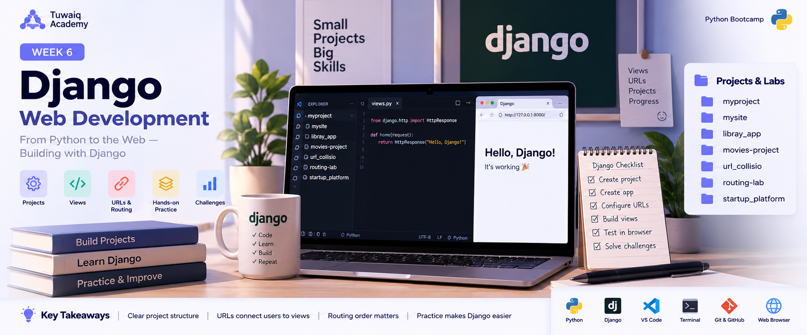

# 🐍 Week 6 — Django Web Development

> **Python Bootcamp | Tuwaiq Academy**  
> A practical week focused on getting started with **Django** and building multiple small projects, labs, assignments, and challenges.

<p align="center">
  
</p>

---

## 🚀 Week Overview

Week 6 was my introduction to **Django Web Development**.

This week focused on understanding the basics of the Django framework and applying what I learned through multiple projects, labs, assignments, and challenges. I practiced creating Django projects and applications, running projects locally, working with URLs and routing, connecting URLs to views, and testing routes in the browser.

The week was mainly **hands-on**, with several Django projects and routing exercises.

---

## 📚 What I Learned

### 🌐 Django Fundamentals

- Introduction to the Django framework
- Creating a Django project
- Creating Django applications
- Understanding the basic Django project structure
- Running a Django development server
- Working with the Django development environment
- Understanding the relationship between a project and an app

### 🔗 URLs & Routing

- Creating URL patterns
- Connecting URLs to views
- Understanding URL routing in Django
- Working with dynamic URL parameters
- Testing different routes through the browser
- Understanding route order
- Handling URL conflicts and collisions

### 👁️ Views

- Creating Django views
- Connecting views with URL patterns
- Returning responses from views
- Using views to control what is displayed for different URLs

---

## 🛠️ Projects & Labs

This week was mainly practical, and I worked on several Django projects and labs:

### 📁 Django Projects

- `myproject`
- `mysite`
- `libray_app`
- `movies-project`
- `startup_platform`

### 🧪 Routing & URL Labs

- `routing-lab`
- `url_collisio`

These projects and labs gave me practical experience with Django setup, project structure, views, URLs, routing, and testing different URL scenarios.

---

## ⚡ URL Collision Assignment

One of the important exercises this week was the **URL Collision** assignment.

I worked with URL patterns such as:

```python
path("products/create/", create_view)
path("products/<str:id>/", details_view)
```

The assignment focused on understanding what happens when a specific URL and a dynamic URL can potentially match the same path.

### 🔑 Key Lesson

Django checks URL patterns **in order**. Because of this, the order of URL patterns can affect which view handles a request.

This exercise helped me understand why URL patterns need to be designed and ordered carefully.

---

## 🏆 Django Challenges

Throughout the week, I also completed **Django challenges** to practice the concepts covered in the sessions.

The challenges helped me reinforce:

- Django project setup
- Applications
- Views
- URLs
- Routing
- Dynamic URL parameters
- Browser testing
- Understanding Django errors
- Debugging routing issues

---

## 🧰 Tools & Technologies

| Tool / Technology | Usage |
|---|---|
| 🐍 Python | Programming language |
| 🌐 Django | Web framework |
| 💻 VS Code | Code editor |
| 🖥️ CMD / Terminal | Project setup and commands |
| 🌍 Web Browser | Testing Django pages and routes |
| 🐙 Git & GitHub | Version control and project submission |

---

## 💡 Key Takeaways

### 1. Django Has a Clear Project Structure
I learned how Django separates the project configuration from individual applications.

### 2. URLs Connect Requests to Views
URL patterns determine which view should handle a requested path.

### 3. Routing Order Matters
When multiple URL patterns can match a request, Django evaluates them in order.

### 4. Dynamic URLs Need Careful Design
Patterns such as:

```python
path("<str:id>/", ...)
```

can match many different values, so specific routes need to be considered carefully.

### 5. Hands-on Practice Makes Django Easier
Working on several projects, labs, and challenges helped me understand Django by actually building and testing things.

---

## 📈 Week 6 Progress

```text
Django Introduction       ████████████████████  Completed
Django Projects           ████████████████████  Completed
Views                     ████████████████████  Completed
URL Routing               ████████████████████  Completed
Dynamic URL Parameters     ████████████████████  Completed
URL Collision             ████████████████████  Completed
Django Challenges         ████████████████████  Completed
```

---

## 🎯 What This Week Added to My Journey

Week 6 was an important step in my Python Bootcamp journey because I started working with a real Python web framework.

Instead of only writing standalone Python programs, I began understanding how Python can be used with **Django** to build web applications, how requests are routed, how views respond to URLs, and how the different parts of a Django project work together.

---

## 📂 Week 6 Work

```text
Week 6
│
├── myproject
├── mysite
├── libray_app
├── movies-project
├── url_collisio
├── routing-lab
└── startup_platform
```

---

## 📝 Reflection

This week gave me my first practical experience with Django. I practiced creating projects and applications, working with views, connecting URLs to views, testing routes in the browser, and solving routing problems.

The different projects and challenges helped me build a stronger understanding of Django and prepared me for the next stage of the bootcamp.

---

## 🏁 Week 6 Complete

**Status:** ✅ Completed

---

## 🔗 Keep Exploring

⬅️ **Previous Week — Week 5**

🏠 **Course Home**

➡️ **Next Week — Week 7**

---

<p align="center">
  <sub>Sarah's Coding Journey • Week 06</sub>
</p>
