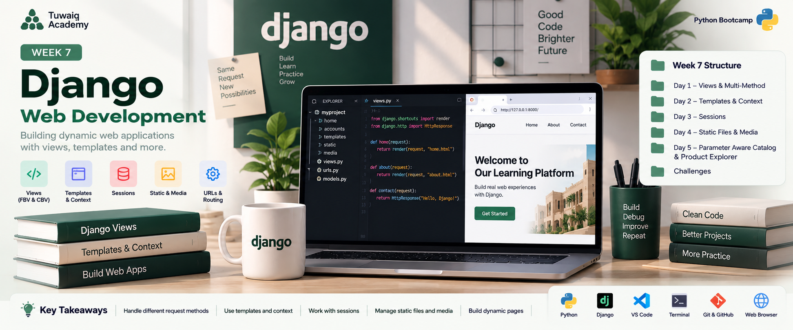

# 🐍 Week 7 — Django Web Development

> **Python Bootcamp | Tuwaiq Academy**  
> A hands-on continuation of Django, focused on views, request handling, templates, sessions, JSON responses, parameters, filtering, and static & media files.

<p align="center">
  
</p>

---

## 🎯 Mission of the Week

Week 7 continued my Django journey by going deeper into how a Django application receives requests, processes them, and returns responses.

I practiced working with request methods, Function-Based Views (FBV), Class-Based Views (CBV), templates and context, sessions, JSON responses, named URLs, parameter-aware pages, filtering, and Django static and media files.

The week was mainly practical, with guided labs, challenges, browser testing, and feature-focused exercises.

---

## 🧭 The Week at a Glance

| Stage | Focus | What I Practiced |
|---|---|---|
| 01 | **Views & Requests** | `HttpRequest`, `HttpResponse`, request methods, and request → response flow |
| 02 | **GET & POST** | Handling page requests and submitted data |
| 03 | **FBV & CBV** | Function-Based Views, Class-Based Views, and `dispatch()` |
| 04 | **Templates & Context** | Passing data from Python to HTML with `render()` and context |
| 05 | **Sessions & JSON** | Reading session data and returning `JsonResponse` |
| 06 | **Parameters & Filtering** | Parameter-aware catalog pages and product filtering |
| 07 | **Static & Media** | Serving CSS/JS/images and handling uploaded media |
| 08 | **Labs & Challenges** | Building, testing, troubleshooting, and verifying Django features |

---

## 📚 What I Learned

### 🌐 Django Views & Request Handling

I learned to think of a Django view as the coordinator between the browser and the application:

```text
Browser → URL → View → Logic / Data → Response → Browser
```

I practiced:

- `request.method`
- `request.GET`
- `request.POST`
- `request.session`
- `request.FILES`
- `request.COOKIES`
- `HttpResponse`
- `render()`
- `JsonResponse`

### 🔄 GET & POST

- **GET** → usually retrieves or displays information.
- **POST** → usually submits data or performs an action.

### 🧩 FBV & CBV

Function-Based View:

```python
def status(request):
    return JsonResponse({"status": "OK"})
```

Class-Based View:

```python
class LoginView(View):
    def get(self, request):
        return render(request, "accounts/login.html")

    def post(self, request):
        return HttpResponse("Login Form Submitted")
```

I also learned that `dispatch()` sends a request to the matching handler such as `get()` or `post()`.

---

## 🧱 Templates & Context

I practiced passing data from a view to an HTML template:

```python
context = {"username": "Aly"}
return render(request, "home.html", context)
```

The idea was:

```text
Python prepares data
        ↓
Context carries the data
        ↓
Template displays it
```

---

## 👤 Sessions

I practiced reading session data with a fallback:

```python
username = request.session.get("username", "Guest")

return render(
    request,
    "accounts/profile.html",
    {"username": username}
)
```

The profile page could therefore display the stored username or `Guest` when no username was available.

---

## 🧾 JSON Responses & Named URLs

I practiced returning JSON:

```python
def status(request):
    return JsonResponse({"status": "OK"})
```

I also practiced named URLs and connecting views to URL patterns.

For a CBV:

```python
path("login/", LoginView.as_view(), name="login")
```

For an FBV:

```python
path("status/", status, name="status")
```

---

## 🧪 Day 1 — Multi-Method View Lab

The Day 1 guided lab focused on a small multi-method Django view system.

### Pages / Endpoints

- `/register/`
- `/login/`
- `/profile/`
- `/status/`

### Practiced

- `RegisterView` with GET/POST
- `LoginView` with GET/POST
- `ProfileView` reading session data
- FBV status endpoint
- `JsonResponse`
- Named URLs
- Browser testing

The completed lab verified the **Register, Login, Profile, and Status JSON** pages.

---

## 🔎 Parameter-Aware Catalog

I worked on a parameter-aware catalog exercise with:

- Course search
- Category filtering
- Difficulty filtering
- Pagination
- Course detail pages
- Returning to the course list

This helped me practice using parameters to control what the page displays.

---

## 🛍️ Product Explorer

I also worked on a Product Explorer filtering exercise.

I practiced:

- Product search
- Category filtering
- Price filtering
- Pagination
- Product detail pages
- Product-not-found handling
- Returning to the product list

---

## 🎨 Static & Media Files

A major part of the week was understanding the difference between **static files** and **media files**.

### 📦 Static Files

Static files are application assets such as:

- CSS
- JavaScript
- Images
- Fonts
- Icons

I practiced referencing static assets in templates:

```django


<link rel="stylesheet" href="">
<script src=""></script>

```

### 🖼️ Media Files

Media files are files uploaded by users at runtime, such as:

- Profile images
- Documents
- PDFs
- Product images

I practiced:

- `MEDIA_URL`
- `MEDIA_ROOT`
- `request.FILES`
- `FileField`
- `ImageField`
- Upload forms

---

## ⬆️ Upload Workflow

```text
HTML Form
   ↓
enctype="multipart/form-data"
   ↓
Django View
   ↓
request.FILES
   ↓
Validation & Save
   ↓
MEDIA_ROOT
```

A file-upload form needs:

```html
enctype="multipart/form-data"
```

for the uploaded file to be included in the request.

---

## 🖼️ Displaying Uploaded Media

I practiced displaying an uploaded image when it exists and using a default image when it does not.

```text
Uploaded image exists → Display uploaded image
No uploaded image      → Display default image
```

---

## 🔐 Upload Validation

I learned that uploaded files should be validated before being stored.

Important considerations included:

- File size limits
- Allowed file types / extensions
- Storage isolation
- Validation before saving
- Backups and cleanup considerations

Example:

```python
def validate_pdf(file):
    if not file.name.lower().endswith(".pdf"):
        raise ValidationError("Only PDF files are allowed.")
```

---

## 🧪 Week 7 Labs & Practice

### Lab 1 — Parameter-Aware Catalog

A catalog exercise with search, filtering, pagination, and course details.

### Lab 2 — Product Explorer

A product exercise with search/filter parameters, pagination, product details, and a product-not-found page.

### Guided Lab — Static & Media-Aware Site

Practiced configuring static files, creating media folders, serving media during development, uploading files, and displaying uploaded images.

### Mini Project — Mini Instagram Clone

A small feed exercise focused on adding image posts, captions, and displaying the resulting posts.

---

## 🏆 Django Challenges

I also completed Django challenges to reinforce the week's concepts through short practical tasks.

One challenge focused on reading the request method:

```python
print(request.method)
```

This connected the request object directly to what happens when a page is tested in the browser.

---

## 🧰 Tools & Technologies

| Tool / Technology | Usage |
|---|---|
| 🐍 Python | Programming language |
| 🌐 Django | Web framework |
| 💻 VS Code | Coding and project development |
| 🖥️ Terminal / CMD | Running Django commands and the development server |
| 🌍 Web Browser | Testing pages, routes, filters, and responses |
| 🐙 Git & GitHub | Version control and project work |

---

## 💡 Key Takeaways

- A Django view receives a request and returns a response.
- `GET` commonly retrieves/displays data, while `POST` commonly submits data or performs an action.
- FBVs use functions, while CBVs use classes and methods.
- `dispatch()` routes a CBV request to methods such as `get()` and `post()`.
- Context carries data from Python into an HTML template.
- Sessions can store and retrieve state across requests.
- `JsonResponse` returns JSON data.
- Named URLs make routes easier to reference.
- Parameters can control filtering and page content.
- Static files and user-uploaded media are handled differently.
- File uploads require the correct form encoding and should be validated.
- Browser testing is an important part of verifying Django features.

---

## 📈 Week 7 Progress

```text
Django Views & Requests      ████████████████████  Completed
GET / POST                   ████████████████████  Completed
FBV / CBV                    ████████████████████  Completed
Templates & Context          ████████████████████  Completed
Sessions & JSON              ████████████████████  Completed
Parameters & Filtering       ████████████████████  Completed
Static & Media Files         ████████████████████  Completed
Labs & Challenges            ████████████████████  Completed
```

---

## 📝 Reflection

Week 7 took my Django practice a step further. I moved beyond basic routing and worked more directly with **requests, views, templates, parameters, sessions, JSON, filtering, static files, and uploaded media**.

The combination of labs, browser testing, and challenges helped me understand how these pieces fit together inside a Django application.

---

## 🏁 Week 7 Complete

**Status:** ✅ Completed

---

## 🔗 Keep Exploring

[⬅️ **Previous Week — Week 6**](../Week%206/README.md)

[🏠 **Course Home**](../README.md)

[**Next Week — Week 8 ➡️**](../Week%208/README.md)

---

<p align="center">
  <sub>Sarah's Coding Journey • Week 07</sub>
</p>
